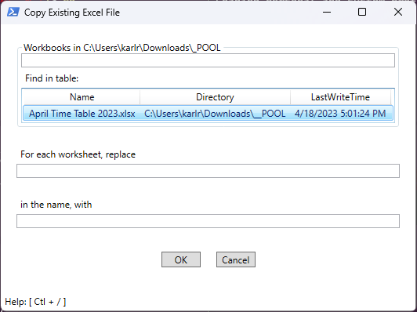

# what
A set of sysadmin tasks used at a place of employment, made easier with the use of a GUI.

## feature

### Copy From Existing Workbook
Make a copy of an existing workbook (``*.xls*``) and perform a find-and-replace on the name of each worksheet.

- GUI
  ```dos
  .\Start.bat ~\Downloads\__POOL
  ```
  

- PowerShell
  ```powershell
  .\module\PsTool\Get-Scripts.ps1 | % { . $_ }
  $myWorkbook = dir ~\Downloads\__POOL\*.xls* | ? { $_.Name -like "*April*" }
  $myWorkbook | ForEach-MsExcelWorksheet -Do { $_.Name = $_.Name -replace "Apr", "Dec" }
  ```

# howto
Run ``Start.bat``, located in the root folder of this project, from any location. Your working directory can contain the Excel files you want to use, or you can pass in as an argument the directory containing them.

## example

Calling ``Start.bat`` from any location:

```dos
path\to\scripts\Start.bat path\to\excelFiles\
```

Calling ``Start.bat`` from location containing Excel files:

```dos
..\scripts\Start.bat
```

# setup

```dos
git clone --recurse-submodules https://github.com/karlronsaria/karlrFastExcelFile
```

# maintain

```dos
git pull
git submodule update --init --recursive
```

---

[Progress Page](./doc/todo.md)
